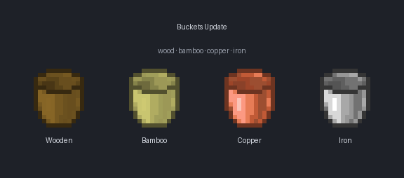
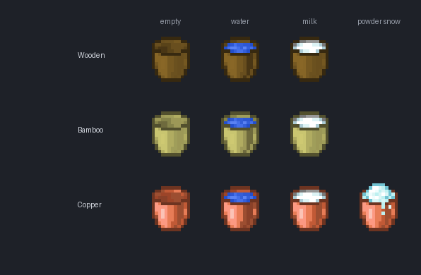
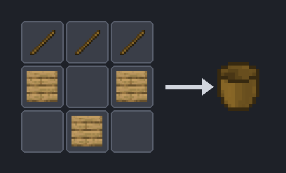
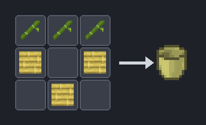
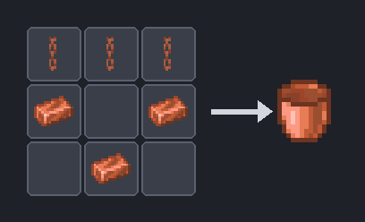
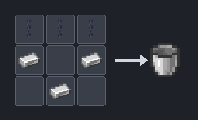

# 🪣 Buckets Update

**The bucket progression vanilla never finished.**

*A vanilla-first tier ladder for buckets: a cheap wooden one, a tougher bamboo one, a permanent copper one — and a quietly revised iron recipe.*

> ⚠️ Targets **Minecraft 26.1.2**, the first post-deobfuscation snapshot. Won't load on earlier versions.

---

## Why this mod

Vanilla has exactly one bucket. You either have iron, or you have nothing — there's no early-game bucket and no reason to ever craft a second kind. Buckets Update fills that one missing piece with a small, readable **tier ladder** that looks like it could have shipped with the base game: wood early, bamboo as a sturdier wooden alternative, copper as a permanent mid-tier, and iron unchanged except for a recipe tweak that frees up the wooden-bowl shape.

No HUD spam, no menus, no new ores. Just buckets that behave the way you'd expect.

---

## The tiers

| Tier | Material | Durability | Empty stacks to | Powder snow |
|---|---|:-:|:-:|:-:|
| 🪣 **Wooden** | 3 planks + 3 sticks | ~16 uses, then breaks | 1 | — |
| 🎋 **Bamboo** | 3 bamboo planks + 3 bamboo | ~32 uses, then breaks | 1 | — |
| 🟠 **Copper** | 3 copper ingots + 3 copper chains | **permanent** (never breaks) | **16** | ✅ |
| ⚙️ **Iron** *(vanilla)* | 3 iron ingots + 3 iron chains | permanent | 16 | ✅ |

- **🪣 Wooden** — the cheapest way to carry water. Light and disposable: ~16 uses before it breaks. Great for your first nether trip or an early farm.
- **🎋 Bamboo** — looks and works like wood, but **twice as tough** (~32 uses). A natural step up if you have a bamboo farm before you have spare iron.
- **🟠 Copper** — the mid-tier sweet spot. Like the iron bucket it's **permanent** (no durability, never breaks) and the empty bucket **stacks to 16**, and like iron it can **scoop powder snow**. Cheaper than iron, and it doesn't oxidise (matching vanilla copper tools).
- **⚙️ Iron** — the unmodified vanilla bucket. Only its **recipe** changes (see below); behaviour is 100% vanilla.

---

## Variants

Every tier comes as an **empty**, a **water**, and a **milk** bucket. Copper additionally has a **powder snow** bucket.

| Variant | How you get it |
|---|---|
| **Empty** | Craft it (see recipes). |
| **Water** | Right-click a water source with the empty bucket. |
| **Milk** | Right-click a cow with the empty bucket — drink it to clear effects, just like vanilla milk. |
| **Powder snow** *(copper only)* | Right-click powder snow with an empty **copper** bucket; right-click to place it back. |

For wood and bamboo, filling, milking and emptying all draw from the **same durability pool** — a milk run wears the bucket just like a water run.

---

## Recipes

Every craftable bucket shares one shape: **three "binder" pieces across the top** (sticks or chains) with the **bucket body as a U** of three pieces below. Same silhouette, four materials.

| Wooden | Bamboo |
|:-:|:-:|
|  |  |
| **Copper** | **Iron** *(revised)* |
|  |  |

**Why the iron recipe changes:** vanilla's bucket shares its `▢ ▢ / ▢` shape with nothing in particular, but the new mod buckets all use the "3 across the top + U" layout — so iron joins them (3 iron chains + 3 iron ingots) for a consistent family and to keep the simple `▢ ▢ / ▢` arrangement free for the wooden bowl. The override ships two ways for robustness: a runtime recipe rewrite on NeoForge and a static datapack recipe on Fabric.

> The water, milk and powder-snow variants are **not** crafted — you obtain them in-world (fill / milk / scoop).

---

## Mechanics in detail

**Durability & repair (wood, bamboo).** These use real vanilla durability: they show the normal durability bar, wear down with use, and break when exhausted. Because they're genuine damageable items you can **repair them by combining two damaged buckets of the same type in the crafting grid** — exactly like repairing a pickaxe. (Being damageable, they don't stack — one per slot.)

**Permanence & stacking (copper, iron).** Copper has no durability at all — it never breaks, never needs repair, and the **empty bucket stacks to 16** so you can haul a column of them. (Minecraft forbids an item from being both damageable *and* stackable, so this is a deliberate trade: copper trades the durability bar for permanence + stacking, matching iron.)

**Powder snow (copper).** The empty copper bucket scoops powder snow and places it back, just like the iron bucket — the wooden and bamboo buckets hold water only.

**Milk.** Right-click any cow with a wood/bamboo/copper empty bucket to get the matching milk bucket; drinking clears status effects like vanilla.

---

## Under the hood

- **Two loaders, no Architectury.** NeoForge **and** Fabric, each a self-contained project, logic mirrored rather than shared — a deliberate choice for MC 26.1's bleeding-edge toolchain.
- **Minecraft 26.1.2**, the first post-deobfuscation snapshot (Mojang official names).
- **30 language translations** included; `en_us` is canonical and the rest are full translations (French uses « seau »).
- Textures are generated from vanilla references by a committed pipeline (`tools/`), and a Python resource validator (`tests/validate.py`) gates every build.

---

### Install & build → see [README.md](./README.md)

Part of the **[Minecraft Revamp](../README.md)** collective — small, focused mods that modernise Minecraft without denaturing it.

Made by [@JessicaMalle](https://github.com/JessicaMalle) with assistance from Claude.

